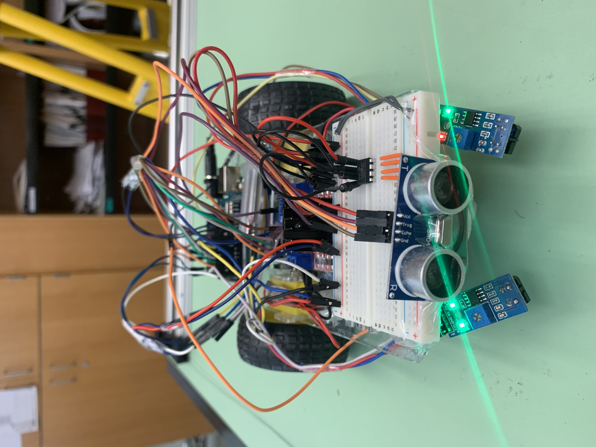

# Autonomous Bluetooth Vehicle

An Arduino-based autonomous vehicle featuring Bluetooth joystick control, infrared line tracking, acceleration measurement, and EEPROM data logging.



## Project Overview

This project was developed as an individual embedded-systems project using an Arduino-based robotic car.

The vehicle was designed to operate in two primary modes:

- **Bluetooth Joystick Mode** – allows the user to control the vehicle through the ArduinoBlue mobile application.
- **Autonomous Line-Tracking Mode** – uses infrared sensors to follow a black line without continuous user input.

The system also uses an MPU6050 accelerometer to measure vehicle acceleration and EEPROM memory to store acceleration data collected during testing.

## Features

- Bluetooth smartphone control using the ArduinoBlue application
- Autonomous infrared line tracking
- Forward and reverse motor control
- Variable motor speed using PWM
- Mode switching between manual and autonomous operation
- MPU6050 acceleration sensing
- EEPROM-based data logging
- Retrieval of previously recorded acceleration data
- Serial monitoring for testing and debugging

## Hardware

- Arduino-compatible microcontroller
- HM-10 Bluetooth module
- MPU6050 accelerometer
- Infrared line sensors
- DC motors
- Motor driver
- EEPROM
- Battery power supply
- Robotic car chassis

## Software & Libraries

- Arduino / C++
- ArduinoBlue
- SoftwareSerial
- Wire / I2C
- MPU6050 library
- EEPROM library

## System Operation

### Bluetooth Joystick Control

The ArduinoBlue application sends throttle and steering values to the Arduino through the Bluetooth module.

The `controlDrive()` function interprets these values and adjusts the direction and speed of the left and right motors.

Different motor speeds are applied while turning so the vehicle can respond to steering commands while continuing to move forward or backward.

### Autonomous Line Tracking

Two infrared sensors monitor the vehicle's position relative to a black line.

The `readLineSensors()` function reads the sensors, while `followLine()` compares their states and modifies the left and right motor speeds to steer the vehicle back toward the line.

### Acceleration Measurement

An MPU6050 sensor measures acceleration along the vehicle's axes.

The program converts raw accelerometer readings into units of **g** and tracks maximum acceleration values during testing.

### EEPROM Data Logging

Acceleration measurements are stored in EEPROM so that data can be retained and retrieved after a test run.

The project includes functions for:

- Recording acceleration data
- Tracking maximum X- and Y-axis acceleration
- Reading recorded values from EEPROM
- Clearing EEPROM memory

## Testing

During classroom testing, acceleration measurements were collected from multiple vehicle runs.

Recorded maximum acceleration values included:

| Test | X-axis | Y-axis |
|------|-------:|-------:|
| 1    | 0.95 g | 0.13 g |
| 2    | 2.50 g | 0.00 g |
| 3    | 0.90 g | 0.00 g |

## Challenges

Several hardware and communication issues were identified during testing:

- The line-tracking sensor experienced reliability issues during the final demonstration.
- The Bluetooth module occasionally disconnected.
- One wheel developed a mechanical issue that affected vehicle movement.

These issues provided opportunities to troubleshoot both hardware and software behavior.

## Future Improvements

Potential improvements to the vehicle include:

- Crash-avoidance sensing
- Improved power delivery and stronger batteries
- More reliable Bluetooth communication
- Improved line-sensor calibration
- GPS-based navigation

## Repository Structure

```text
autonomous-bluetooth-vehicle/
└── README.md
```

## Author

**Vanessa Obasi**

Computer Engineering
